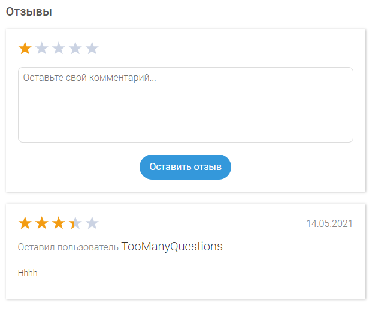

## Клиентская часть веб-приложения для платформы рекомендации массовых онлайн курсов

> **English title**: Web app for mass online courses recommendation platform

## Live-версия приложения

[Ссылка на веб-страницу приложения](https://mooc.ij.je)

## Функциональные возможности

-   Регистрация
    

-   Аутентификация
    

-   Подборки курсов
    

-   Профиль пользователя, списки избранных и просмотренных курсов
    

-   Поиск по курсам с фильтрацией по категориям
    

-   Страница курса с детальной информацией
    

-   Оставление и просмотр рецензий на курс
    

## Команда

-   **Абдельсалам Шади Мазен** - фронтенд веб-разрабочик
-   **Дондик Ярослав Витальевич** - бэкенд веб-разработчик
-   **Кирюхин Андрей Алексеевич** - android-разработчик
-   **Самаренко Андрей Валерьевич** - iOS-разработчик

---

> Данный продукт разрабатывается в качестве курсовой работы национального исследовательского университета **«Высшая школа экономики»** 
